# 🏝️ Window Dynamic Island

A smooth, interactive overlay for your desktop, inspired by Apple's Dynamic Island. It brings a sleek media widget, notifications, and system alerts to Windows without slowing down your PC. Built natively with hardware-accelerated Direct2D rendering for a buttery-smooth 60 FPS experience.

---

## 📸 See it in Action

  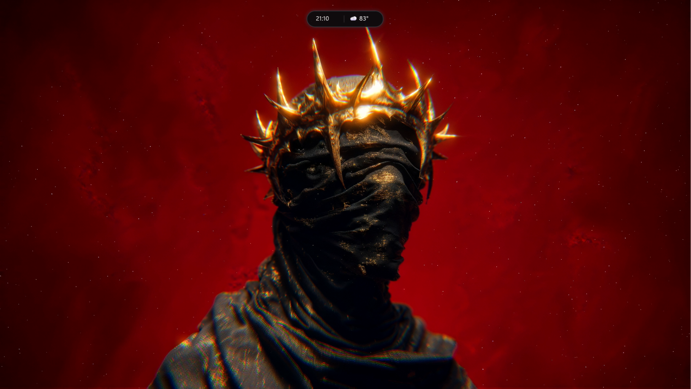

### Dashboards

| Media Player | Calendar | Weather | Game Overlay | Idle View | System Status | Battery Status | Volume OSD |
| :---: | :---: | :---: | :---: | :---: | :---: | :---: | :---: |
| 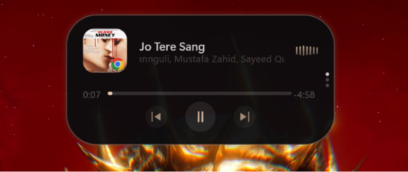 | 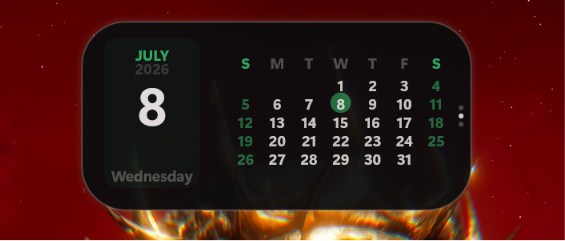 | 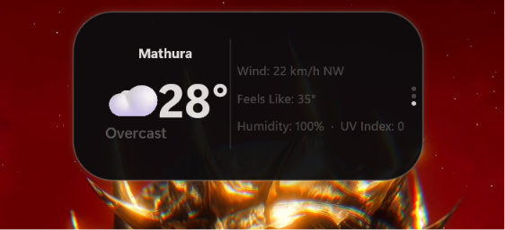 | 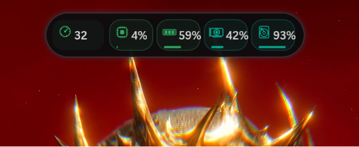 | 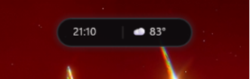 | 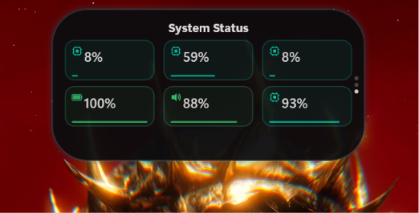 | 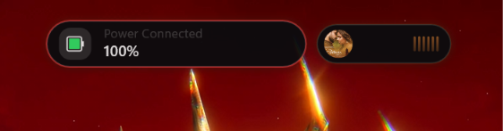 | 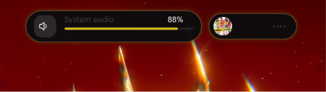 |

### Privacy Indicators

| Camera Detected | Microphone Detected |
| :---: | :---: |
| 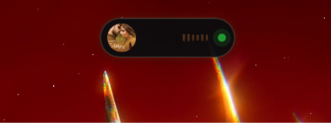 | 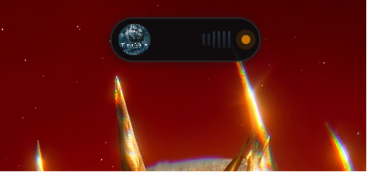 |

---

## ✨ What it does

- 🟢 **Privacy Dots:** See an orange dot when your mic is on and a green dot for your camera.
- 🎵 **Media Player:** Live album art, audio waveforms, and playback controls. Supports **Tidal, Deezer, MPC-HC, iTunes, Plex, and Amazon Music** in addition to Windows system players. Robust auto-recovery ensures it stays connected through track changes and system sleep.
- 📅 **Dashboards:** Scroll your mouse wheel or swipe to switch between Media, Calendar, and live Weather (via wttr.in).
  - **Calendar:** Displays a monthly calendar highlighted with the current date.
  - **Weather:** Real-time stats including Wind speed, Humidity, Feels Like temperature, and **UV Index**, optimized to prevent any text clipping.
- 💻 **Active Window Indicator:** The collapsed idle pill dynamically cycles between showing weather temperature and your active foreground window (represented by a computer 💻 icon).
- 📊 **System Status & Game Overlay:** 
  - **System Status Dashboard:** Real-time, color-coded grid cards displaying CPU, RAM, GPU, Battery, Volume, and Disk usage.
  - **Game Overlay Mode:** Real-time FPS, CPU, GPU, and RAM stats built right in.
- 🎙️ **Speech-to-Text (STT) Dictation:** Speak naturally to transcribe voice into text in real time! Features full controls to Pause/Resume, Copy to clipboard, Clear text, and export directly to Notepad (`Notepad ↗`).
- 🤖 **Jarvis Voice Assistant:** Integrated local voice assistant mode responding to the **"Hey Jarvis"** wake word, featuring a clean visual microphone assistant pill.
- 🎛️ **Desktop Settings Dialog:** A native standalone configuration window (accessible via right-click) to customize settings in real time. Features sections for Layout, Themes, Modules, Speech & Voice, and actions like Save or Reset to Defaults.
- 🔄 **Mini Pill Carousel:** Cycle through active modules using mouse scroll wheel, swipe navigation gestures (left/right drag), or tap actions to expand target widgets directly.
- 🍃 **Premium Transitions:** Animated hide/unhide events utilize a gorgeous opacity fade and tuned critically-damped spring physics to feel organic and fluid at 60 FPS.
- 🧪 **Premium Pastels:** The dashboards are styled with a gorgeous **Classic Pastel Mint Green (`#33C773`)** and **Teal-Mint (`#00C7A6`)** palette, featuring dynamic backdrop card and border tints matching the metric's state (green, yellow, or warning red).
- 🔒 **Key Alerts:** Get quick visual popups when you hit Caps Lock or Num Lock.
- 🔋 **Battery Alerts:** Displays fluid animated alerts when you plug in, unplug, hit low battery levels (below 20%, 15%, 10%, or 5%), or reach full charge (100%), featuring the dedicated battery indicator layout. ([Preview](previews/battery-status.png))
- 🔊 **Volume OSD:** A sleek on-screen display pops up whenever you increase or decrease the system volume, showing the current volume level with a smooth progress bar. ([Preview](previews/volume-inc-dec.png))
- 🔌 **Device Status:** Alerts when you plug in a USB drive or connect a Bluetooth device.
- 📋 **Clipboard & Notifications:** Instantly preview what you just copied (visible for 4s) or see your latest Windows notifications.
- 🎨 **Themes:** Pick from OLED Black, Midnight Blue, Deep Purple, or pick your own hex color using the built-in color pickers.

---

## ⚙️ Customization

Tweak the mod easily from the native **Dynamic Island Settings Dialog** (right-click the island to open):
- **Position:** Place it Top Center, Top Left, Top Right, or Bottom Center.
- **Scale:** Shrink or enlarge it (0.8x up to 2.5x) to fit your screen perfectly.
- **Style:** Choose the classic iPhone Pill look or the modern Windows 11 Fluent flyout.
- **Colors:** Match it to your album art automatically, use system colors, or pick your own.
- **Speed:** Set animations to Slow, Normal, or Fast.
- **Modules:** Turn on or off individual modules (Media, Clipboard, Battery, Progress, STT, Game Overlay, and Tools).
- **Auto-Hide:** Configure visibility inactivity timeouts (Never, Instant, 5s, 10s, 30s, 60s).

---

## 💬 Let's Chat!

Found a bug? Have a cool feature idea? We want to hear from you! Please drop an issue on our [GitHub Repository](https://github.com/Aonikyadav/window-dynamic-island/issues). Your feedback keeps this mod alive.

---

## 🙌 Shoutouts

- **[Aonik Yadav](https://github.com/Aonikyadav)** — Built and maintains this mod. Designed the Dynamic Island UI, system dashboards, and all feature integrations.
- **AI Assistance** — Helped style the premium Classic Pastel Green & Mint dashboards, polish the auto-hide engine, add voice capabilities, and fix text clipping.

---

## 🛠️ Nerd Stuff

Built with C++23 and deeply integrated with Windows for maximum performance:
- **Direct2D:** Hardware-accelerated rendering for buttery 60 FPS animations.
- **Zero Lag:** Rate-limited polling and efficient system hooks mean it uses almost 0% CPU in the background.

---

## 📜 License

This project uses the [MIT License](LICENSE). Feel free to build on it!
